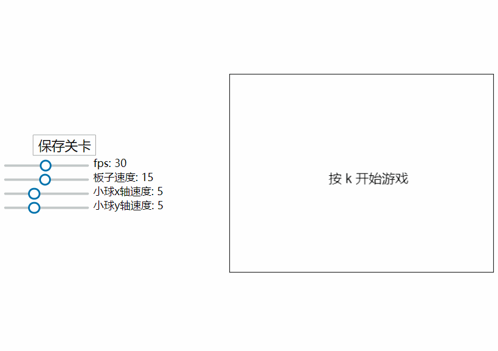

# blockbreaker（打砖块）
该游戏使用了一个由纯**ES6**自建的**游戏框架**完成

该框架的**核心原理**是通过**定时器**定义一个**游戏帧率**，在每一帧里都会依次执行 **update**、**debug** 和 **draw** 这一调用链，而这就像 **React** 里的组件一样，父组件的 **render** 会调用子组件的 **render**，在我的框架里是 **Game -> Scene -> ImageMode | AnimationMode | TextMode**，这样不用每次手动去更新和绘制视图页面，**将逻辑和视图分离出来**。

实现了**场景切换**，如 game over场景

实现了**数据双向绑定**，能随时控制各种参数

实现了**资源预加载**，在资源全部加载完成后游戏才开始

实现了**动态人物模型**，能在 canvas 显示动态的人物效果

实现了**关卡编辑器**，鼠标点击可生成砖块或增加其生命，并可以中途保存关卡数据

实现了通过鼠标拖曳控制小球坐标

> [在线地址](http://106.53.84.52/game/blockbreaker/)

# 操作

按`f`键开始游戏

按`p` 键暂停游戏

按 `a` `d`键控制挡板

# 游戏预览

